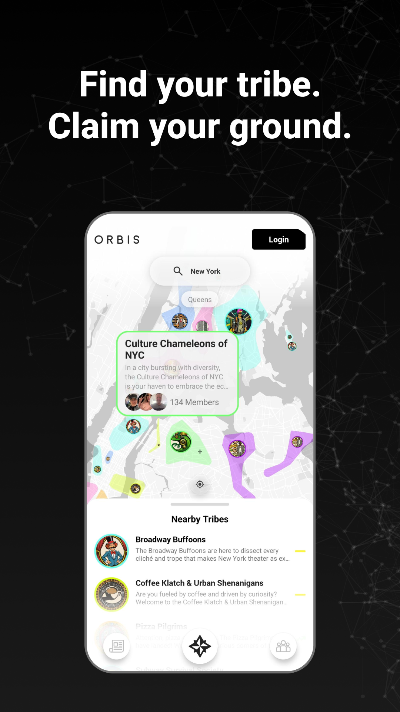
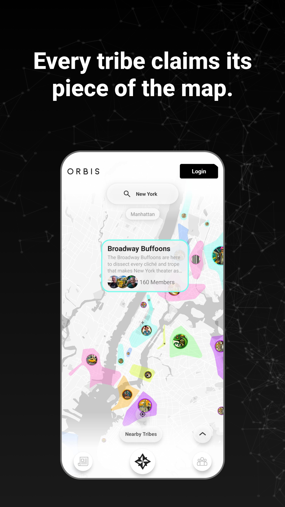
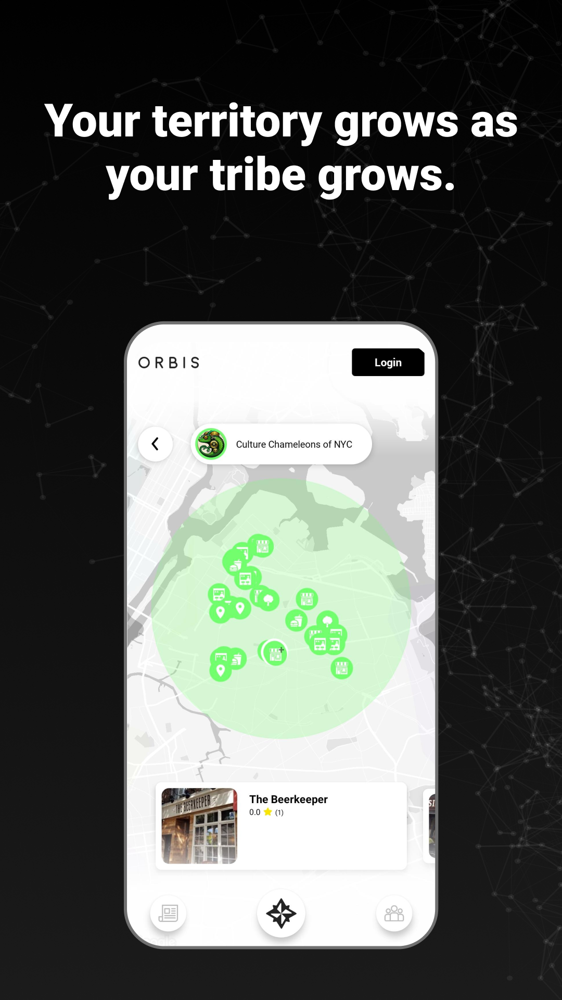
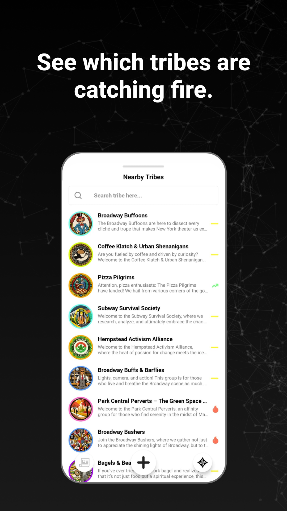
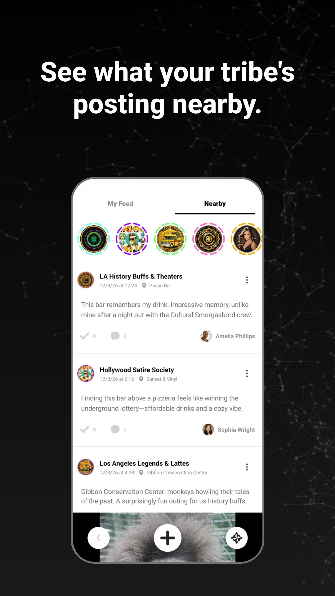

# Orbis Android

**Find your tribe. Claim your ground.**

Orbis is a **location-based social network** built around real-world places and the communities — *tribes* — that claim them. Everything in Orbis lives on the map: you find the tribes near you, claim places and territory for your tribe, and see what your tribe is posting around you. The more your tribe grows, the more ground it holds.

This repository is the **native Android client** (Kotlin). It's a thin client that connects to an Orbis backend, so anyone can run their own instance and point the app at it.

<p align="center">
  
  
  
  
  
</p>

## What you can do

- **Explore the map** — Discover tribes, places, events, and posts around your current location.
- **Claim territory** — Tribes claim real-world places and grow their territory on the map (the polygon / geohash system). Your territory expands as your tribe grows — no physical check-in required.
- **Tribes** — Create or join tribes, manage members and admins, follow tribes, get recommendations, and moderate (ban / block / report).
- **Places** — Add and follow real-world places, rate them, and browse their activity and events.
- **Events** — Create events tied to a place or tribe and RSVP / attend.
- **Feed & posts** — A location-aware feed (nearby, your tribe, per-place) with posts, comments, and reactions.
- **Stories** — Share ephemeral stories and view nearby and tribe stories.
- **Messaging** — Direct one-to-one chat with other users.
- **Profiles** — User profiles with followers / following and personal activity feeds.
- **Notifications** — Real-time push notifications (Firebase Cloud Messaging).

**Sign-in:** email / password (Firebase Auth) and Google.

## How it works

Orbis is **operator-run**: this app connects to a backend you control (the Orbis Clone Proxy + Java backend) via an `X-MASTER-Key`. Location is central — your device location places you on the map, and tribes' claimed places and territory are computed server-side as map polygons, so social activity maps onto real geography.

## Tech stack

- **Language:** Kotlin
- **Architecture:** MVVM — feature modules (ViewModel / Views / Adapters)
- **Networking:** Retrofit (`SwaggerApiClient`) against the Orbis REST API
- **Local storage:** Room (offline feed / tribe caching)
- **Maps & location:** Google Maps SDK + device location
- **Auth & push:** Firebase Authentication + Firebase Cloud Messaging
- **Android SDK:** API 24–35

## For clone operators — rename the app before publishing

"Orbis" and its branding belong to the original project. If you deploy your own instance, **you must rebrand before shipping** — do not publish it as "Orbis." At minimum, change:

- **App name** — `app_name` in `app/src/main/res/values/strings.xml`
- **Application ID / package** — `applicationId` in `app/build.gradle` (currently the placeholder `com.example.yourappname`) and the `com.orbis.orbis` package
- **Launcher icons & branding** — replace the app icons and any in-app logos

---

# Orbis Android — Developer Setup

## Prerequisites

- **Android Studio** Hedgehog (2023.1.1) or later
- **JDK 8** (configured in the project)
- **Android SDK** with API level 24–35 installed
- **A valid `X-MASTER-Key`** configured by an Orbis Clone Proxy operator (see [Obtaining an API Key](#obtaining-an-api-key) below)

---

## 1. Configure `local.properties`

The project uses `local.properties` (which is **git-ignored** and never committed) to inject secrets into `BuildConfig` at compile time.

Create or open `local.properties` in the **project root** (same level as `gradlew`) and add the following keys:

```properties
# Auto-generated by Android Studio — update the path to match your machine
sdk.dir=/path/to/your/Android/sdk

# Backend URLs
BASE_DEBUG_URL=https://your-debug-backend-url.com
BASE_PROD_URL=https://your-prod-backend-url.com

# API Key issued by the Orbis Clone Proxy operator
X-MASTER-KEY=your_master_java_key_here

# Google Maps API Key used for map service
# Note that the API key is linked to the encryption key used to sign the APK.
MAPS_DEBUG_API_KEY=AIza****
MAPS_PROD_API_KEY=AIza****
```

> ⚠️ **Never commit this file.** It is already included in `.gitignore`.

### How it maps to `BuildConfig`

| `local.properties` key | `BuildConfig` field | Used in build type |
|------------------------|---|---|
| `BASE_DEBUG_URL`       | `BuildConfig.BASE_URL` | `debug` |
| `BASE_PROD_URL`        | `BuildConfig.BASE_URL` | `release` |

These values are consumed in `SwaggerApiClient.kt` automatically — no code changes needed.

---

## 2. Configuring API Key

The `X-MASTER-Key` is **a static credential you create yourself**, and it has to match the one on the configuration of your current Java backend.

---

## 3. Keystore Setup (Release Builds Only)

Release builds require a `keystore.properties` file in the project root:

```properties
keyAlias=your_key_alias
keyPassword=your_key_password
storeFile=path/to/your.keystore
storePassword=your_store_password
```

---

## 4. Firebase Configuration

The project requires a `google-services.json` file placed at `app/google-services.json`.

### If you are setting up a new Firebase project

1. Go to the [Firebase Console](https://console.firebase.google.com) and open your debug/prod project.
2. Navigate to **Project Settings → Your apps → Android app**.
3. Download `google-services.json` and place it in `app/`.
4. In **Google Cloud Console → APIs & Services → Credentials**, ensure the API key has an **Android restriction** set to the app's package name (`com.example.yourappname`) and SHA-1 certificate hash.
